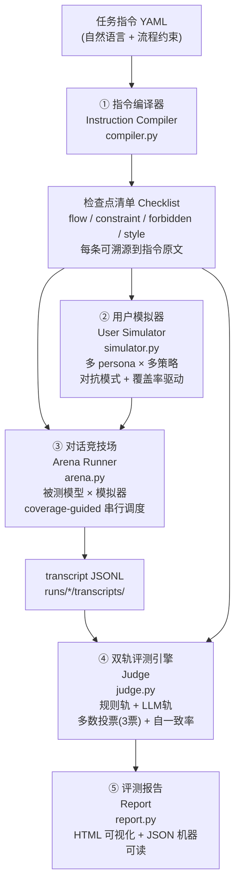

# EvalCall — 外呼对话模型指令遵循自动评测系统

> 美团黑客松·赛道二：复杂指令下的多轮对话评测系统
> 在线演示：https://kaijie0074-art.github.io/evalcall/

## 一句话定位

**EvalCall 自动测试并评估外呼模型在特定任务指令下的指令遵循效果，输出可审计的模型上线报告。**

被评对象是外呼模型，SOP 是评分依据，用户模拟器是标准测试工具，对话日志是测试过程数据。SOP 诊断、裁判校准和根因归因用于防止错误归责，不取代“评模型”主线。工作台同时提供“模拟测试模式”和“已有日志质检模式”：前者由多 persona 用户模拟器生成测试对话，后者对已经产生的真实/脱敏日志使用同一套评分标准质检。

每次运行都落盘 SOP、对话、Checklist、目标模型和结果的版本/hash，以及逐项证据、P0 门禁、履约率、覆盖率、未触达检查点、人工复核队列、token/耗时和可比性 manifest。

## 先看产品，再看研究

- 决赛固定公网入口：[EvalCall 决赛演示入口](https://kaijie0074-art.github.io/evalcall/live.html)
- 在线六步流程工作台：[EvalCall 产品演示](https://kaijie0074-art.github.io/evalcall/app.html)
- 研究与历史证据：[项目证据首页](https://kaijie0074-art.github.io/evalcall/)
- 本地启动：`python3 -m evalcall demo`，打开 `http://127.0.0.1:8765/`
- 决赛公网启动（自己的 Mac）：双击 `scripts/启动决赛公网Demo.command`
- 答辩数字索引：[`docs/EvalCall证据索引-20260712.md`](docs/EvalCall证据索引-20260712.md)

## 决赛最终交付（2026-07-15）

- 统一 PPT + 公网 Demo + U 盘兜底包：[`submission/EvalCall决赛提交包-20260715/`](submission/EvalCall决赛提交包-20260715/)
- 公网决赛验收记录：[`docs/acceptance/EvalCall公网决赛验收记录-20260715.md`](docs/acceptance/EvalCall公网决赛验收记录-20260715.md)
- 10 分钟正式讲稿：[`docs/EvalCall答辩演示脚本-10分钟-20260714.md`](docs/EvalCall答辩演示脚本-10分钟-20260714.md)
- 10 分钟问答预案：[`docs/EvalCall答辩问答预案-10分钟-20260714.md`](docs/EvalCall答辩问答预案-10分钟-20260714.md)
- 最新方案设计：[`docs/EvalCall方案设计文档-最终版-20260714.md`](docs/EvalCall方案设计文档-最终版-20260714.md)
- 提交与现场清单：[`docs/EvalCall决赛提交清单-20260714.md`](docs/EvalCall决赛提交清单-20260714.md)

默认分支中的 `SPEC.md` 与上述最终方案保持同步；历史规格已移入 `docs/EvalCall方案设计历史基线-20260607.md`。

主演示使用健康 SOP 的“配送时间改约”：同一批 10 通固定用户输入、同一 SOP、同一 21 项 Checklist、同一 Judge 下，模型策略 v1 为“打回”（P0 3/10、平均分 62.5），v2 为“可上线”（P0 0/10、平均分 91.4），履约率保持 40%。原生 diff 显示 6 项改善、1 项 style 退化待复测；系统没有手改 judgments，也没有更换评分尺。

六步产品主链：

1. 配置测试任务：输入任务指令、被测模型，或输入任务指令与已有对话；
2. 建立评分标准：把 SOP 编译为可溯源的 L0 通用安全规则 + L1 业务规则；
3. 测试外呼模型：用户模拟器按 persona 生成测试对话，或评估已有日志；
4. 输出模型评测报告（核心交付）：模型版本、门禁、履约率、P0、关键失败、覆盖率和未触达检查点；
5. 分析失败原因：综合模型表现、SOP 健康、裁判 NA/分歧和测试分布，归因到模型/SOP/裁判/测试数据；
6. 根据根因生成对应优化和同尺回归计划；模型问题保持 SOP/Checklist hash 不变并返回第 3 步。

```bash
# 零依赖产品页 + 可选本地实时整批评测
python3 -m evalcall demo

# 已有日志质检入口：直接评测真实/脱敏对话
python -m evalcall evaluate \
  --task data/tasks_real/real_recruit_rider.yaml \
  --transcripts runs/real_recruit_20260702/transcripts.jsonl \
  --checklist runs/real_recruit_20260702/checklist.json \
  --votes 3 \
  --out runs/real_recruit_offline
```

> fail-closed：输入坏、裁判整批 NA、尺子不可比或无有效 judgments 时，系统不会包装成“可上线”。

## 模型评测主线与可信度保障

第 4 步模型评测报告是核心交付；下面三层中“评模型”是产品主线，“审指令”和“校裁判”是防止错误归责的可信度保障：

| 层 | 回答的问题 | 机制 | 实测战绩 |
|----|-----------|------|---------|
| **评模型** | 模型守不守指令？ | 指令编译 → 对抗模拟 → 双轨判定（裁判提示词携带指令原文）→ 量化报告 | 官方两任务端到端实测，每条 fail 附对话原文证据 |
| **审指令** | 分低是模型差，还是指令本身有病？ | 指令体检器 `evalcall/lint.py`：自动检测自相矛盾/不可行/歧义/缺失分支，附修订建议 | 自主发现官方任务二「≤20字上限 vs 43字参考话术」物理冲突、任务一业务规则自相矛盾（详见 `runs/lint/`） |
| **校裁判** | 裁判自己判得准不准？ | 已知答案注入 `calibrate.py`：合成对话埋好真值 → 跑裁判 → 输出查准率/查全率/混淆矩阵 | 评测报告自带误差棒；开发中实测抓出并修复一例裁判系统性误判 |

配套：**测试充分性量化**——报告输出检查点触达率与测试盲区清单（从未被任何轨迹触达的检查点），「测得充分」从形容词变成百分比。

### 决策与安全增强（改进版 · 让质检团队敢用、能驱动上线决策）

在三层闭环之上，把评测从「打分」推进到「把关」与「业务命脉」：

- **上线红线门禁**：报告输出二值决策「可上线 / 打回」（任一 P0 fail 即打回），不只给分数。门禁可信度由 calibrate 的 **P0 查全率分层**兜底。
- **安全/合规红线轨**（`evalcall/safety.py` + `data/policy/safety_redlines.yaml`）：辱骂/歧视/隐私泄露/未告知 AI 身份/诱导等安全底线独立成 P0 一票否决轨，与 forbidden 共享单一规则源。
- **履约达成（outcome 检查点）**：从任务 `goal` 生成，评「这通电话有没有把活办成」——真实外呼第一 KPI。
- **真实性/拟人度（authenticity 检查点）**：应对用户「你是不是机器人」的质疑（仅当指令涉及身份时生成，守可溯源）。
- **低置信交人复核**：裁判分歧/规则冲突的判定标 `needs_human_review`，交人兜底。
- **业务分级 P0/P1/P2** + 报告决策头条、通话级问题清单、证据跳转对话原文。
- **跨版本回归 `diff`**（规则/履约判定=确定、LLM判定=需复测）+ **活清单增量 `grow`**（从指令挖遗漏检查点，候选过溯源硬闸防循环论证，进待人工确认区）。

> 检查点类型已扩展为 `flow / constraint / forbidden / style / outcome / authenticity`；schema 新增 `safety`、`policy_source` 字段。

---

## 痛点

履约数字人每天产生海量外呼对话。任务指令往往包含复杂流程分支和多重合规约束（关键信息播报顺序、禁止话术、隐私保护要求等）。传统质检依赖人工抽听：

- **贵**：抽听成本随规模线性上升，全量覆盖几乎不可能
- **慢**：问题发现滞后，难以支撑快速迭代
- **难量化**：评分依赖个人经验，缺少统一标准，结果无法追溯

---

## 架构

### Mermaid



### ASCII（纯文本环境）

```
任务指令 YAML
     │
     ▼
① 指令编译器 compiler.py
   └─ 输出：检查点清单（flow/constraint/forbidden/style，每条含 source_quote）
     │
     ├──────────────────────┐
     ▼                      ▼
② 用户模拟器           ③ 对话竞技场 arena.py
   simulator.py            被测模型 × 模拟器
   多 persona × 多策略      coverage-guided 调度
   对抗 + 覆盖率驱动         └─ 输出：transcript JSONL
     │                      │
     └──────────────────────┘
                            ▼
                   ④ 双轨评测引擎 judge.py
                      规则轨（确定性探测器，只产线索不独裁）
                      LLM轨（逐检查点，证据引用，3票投票）
                      + 自一致率 / 双轨冲突率
                            │
                            ▼
                   ⑤ 评测报告 report.py
                      HTML 可视化报告
                      JSON 机器可读结果
```

---

## 五大组件说明

| 组件 | 文件 | 职责 |
|------|------|------|
| ① 指令编译器 | `evalcall/compiler.py` | 将自然语言任务指令解析为结构化检查点清单。每条检查点含 `id`、`type`（flow/constraint/forbidden/style）、`text`、`source_quote`（可溯源原文）、`severity`（critical/major/minor）。 |
| ② 用户模拟器 | `evalcall/simulator.py` | LLM 扮演被呼叫用户，支持六种 persona（配合型/打断型/跑题型/质疑型/情绪型/沉默型）。对抗模式：约束/禁止项作为对抗目标注入；coverage-guided：跨轨迹未触达的检查点被标记为优先攻击目标（cli 主循环反馈环，已实现非口号）。 |
| ③ 对话竞技场 | `evalcall/arena.py` | 编排被测模型与用户模拟器之间的多轮对话，coverage-guided 调度：每条轨迹判定后，未触达检查点作为优先攻击目标注入下一条轨迹（反馈环依赖前序判定，故按设计串行；无反馈模式可并行扩展）。输出标准 transcript JSONL。 |
| ④ 双轨评测引擎 | `evalcall/judge.py` | 规则轨（确定性**探测器**：禁语/关键信息子串命中只产生"线索"，不独裁——避免「不太好的话」误命中禁语「好的」式的系统性误杀）+ LLM轨（逐检查点判定 pass/fail/NA，必须引用对话原文作为证据，默认 3 票多数投票定结论）。规则命中线索交 LLM 轨合议：双确认→fail(method=rule+llm)，LLM 否决→标 rule_conflict 供人工复核。附带可靠性指标：judge 自一致率、规则/LLM 双轨冲突率。 |
| ⑤ 评测报告 | `evalcall/report.py` | 聚合判定结果，生成总分 + 四维雷达（流程完整度/约束遵循率/异常处理/话术合规）、逐检查点明细（结论+证据+置信度）、失败案例剖析、persona 维度切片。输出 HTML 可视化报告 + JSON 机器可读结果。 |

---

## 快速开始

### 安装依赖

```bash
pip install pyyaml jinja2 requests
# 可选：rich（终端彩色进度条）
pip install rich
```

### 配置 LLM 后端

EvalCall 支持四种后端，通过环境变量切换：

`python3 -m evalcall demo` 未显式配置时会优先使用本机已登录的 Codex CLI；内置样例在 SOP、完整对话和评分标准哈希一致时直接复用对应已验证批次，自定义材料才现场调用模型。

**方式一：本地 Claude CLI（需确保 CLI 登录状态可用）**

```bash
export EVALCALL_BACKEND=claude-cli
# 确保本地已安装 claude CLI
```

**方式二：OpenAI 兼容 API**

```bash
export EVALCALL_BACKEND=openai
export OPENAI_BASE_URL=https://api.openai.com/v1
export OPENAI_API_KEY=<your-api-key>
export EVALCALL_MODEL=gpt-4o
```

**方式三：Codex CLI（本机工作台默认优先，复用本地登录）**

```bash
export EVALCALL_BACKEND=codex-cli
export EVALCALL_MODEL=gpt-5.6-sol
export EVALCALL_REASONING_EFFORT=xhigh
```

**方式四：Mock 回放（CI/无网演示兜底）**

```bash
export EVALCALL_BACKEND=mock
```

被测模型可独立配置（与评测用 LLM 后端分离）：

```bash
export TARGET_BACKEND=openai
export TARGET_BASE_URL=https://your-model-endpoint/v1
export TARGET_API_KEY=sk-...
export TARGET_MODEL=your-model-name
```

### 运行评测

```bash
# 已有日志质检模式：直接评测已有对话
python -m evalcall evaluate --task data/tasks/t02_delivery_reschedule.yaml \
  --transcripts your_transcripts.jsonl --out runs/t02_offline

# 跑一次完整评测（指定任务文件，默认每 persona 3 条轨迹、裁判 3 票多数投票）
python -m evalcall run --task data/tasks/t01_overdue_appease.yaml

# 指定 persona、轨迹数与裁判票数
python -m evalcall run --task data/tasks/t01_overdue_appease.yaml --personas all --n 5 --votes 3

# 生成/刷新报告（基于已有轨迹）
python -m evalcall report --run runs/t01_overdue_appease/

# 跨版本回归对比（规则/履约判定=确定，LLM判定=需复测确认）
python -m evalcall diff --base runs/v1/ --new runs/v2/

# 活清单增量：提议指令里遗漏的检查点（过溯源硬闸，写入待人工确认区，不自动并入）
python -m evalcall grow --task data/tasks/t01_overdue_appease.yaml

# 人工复核队列导出 / 回填（不覆写机器原判）
python -m evalcall review-export --run runs/t02_offline
python -m evalcall review-apply --run runs/t02_offline \
  --decisions runs/t02_offline/review_queue.csv --out runs/t02_human_review
```

### 输出产物

```
runs/
└── <task_id>/                 # 每个任务一个目录（如 runs/t01_overdue_appease/）
    ├── checklist.json         # ① 编译出的检查点清单（可固化复用，A/B 同尺）
    ├── transcripts.jsonl      # 全部对话轨迹（单文件，每行一条）
    ├── judgments.json         # 扁平判定列表（report 直接消费）
    ├── judgments_by_run.json  # 按轨迹嵌套的判定（备查）
    ├── summary.json           # 机器可读聚合结果（平均分/否决数/分歧率/persona切片）
    ├── manifest.json          # 指令/尺子/安全/黄金集 hash + 模型/代码/票数
    ├── telemetry.json         # 调用、耗时、token（实际/估算分标），不存 prompt 原文
    ├── review_queue.json/csv  # P0 / NA / 分裂票 / 规则冲突复核队列
    └── report.html            # HTML 可视化报告（浏览器直接打开）
```

> 说明：聚合的机器可读结果在 `summary.json`（不是 `report.json`）；报告产物是 `report.html`。

---

## 脱敏数据接入

### 路径一：在线模拟评测（无真实数据）

直接使用 `data/tasks/*.yaml` 中内置的模拟任务（已覆盖外卖催单确认、配送时间预约、商家回访、超时安抚、隐私合规五类场景）。无需任何真实数据即可完整跑通评测流程。

```bash
python -m evalcall run --task data/tasks/t02_delivery_reschedule.yaml
```

### 路径二：离线轨迹评测（接入真实/脱敏数据）

若已有脱敏对话轨迹，可跳过模拟器直接送入评测引擎：

1. 将脱敏轨迹转换为标准 JSONL 格式（字段映射说明见 `data/README.md`）
2. 把轨迹文件存为 `runs/<your-dir>/transcripts.jsonl`（单文件，每行一条轨迹；`report.py` 直接读取该文件）
3. 执行离线评测命令

```bash
python -m evalcall evaluate \
  --task data/tasks/your_task.yaml \
  --transcripts data/your_transcripts.jsonl \
  --out runs/your-data-dir/
```

官方数据到达后，只需按 `data/README.md` 的字段映射表做一次格式转换，无需修改评测逻辑。

---

## 创新点

1. **指令→检查点编译，可溯源**：评的不是笼统印象，而是逐条对应指令原文的检查点。评测结论有原文依据，可审计、可复现。

2. **对抗式模拟器 + coverage-guided 反馈环**：模拟器不随机聊天——约束项作为对抗目标定向诱导，且每条轨迹判定后未触达检查点自动成为下一条轨迹的优先攻击目标（对标 FLARE 的 coverage-guided behavioral fuzzing，首次用于对话指令遵循质检）。报告输出触达率与盲区清单。

3. **双轨判定 + 跨模型裁判团 + 自一致率**：规则轨保证确定性，LLM 轨处理语义复杂场景；3 票可由不同模型投出（`JUDGE_MODELS=haiku,sonnet,opus`）——同模型重复投票只降方差不降偏差，跨模型投票才能消单一裁判的系统性偏见。自一致率和双轨冲突率提供可靠性度量，裁判准确率经黄金集校准（见 `calibrate.py`）。

4. **数据即插即用**：格式适配层将脱敏数据映射到内部 schema，评测逻辑与数据格式解耦。官方数据一到，换个目录就能跑，无需修改核心代码。

---

## 目录结构

```
美团黑客松/
├── SPEC.md                          # 赛题规格与架构设计
├── evalcall/
│   ├── __init__.py
│   ├── llm.py                       # LLM 后端抽象（openai/claude-cli/mock）
│   ├── compiler.py                  # ① 指令编译器
│   ├── simulator.py                 # ② 用户模拟器
│   ├── arena.py                     # ③ 对话竞技场
│   ├── judge.py                     # ④ 双轨评测引擎
│   ├── report.py                    # ⑤ 报告数据聚合
│   ├── templates/report.html.j2     # HTML 报告模板
│   └── cli.py                       # 命令行入口
├── data/
│   ├── tasks/*.yaml                 # 模拟任务指令库
│   ├── personas/*.yaml              # 用户 persona 库
│   └── README.md                    # 脱敏数据接入说明
├── runs/                            # 输出：轨迹 + 判定 + 报告
├── README.md                        # 本文件
└── docs/                            # 提交材料
```

---

## 版本

`0.2.0` — 产品化评测、归因、复核、可复现与证据包版本
