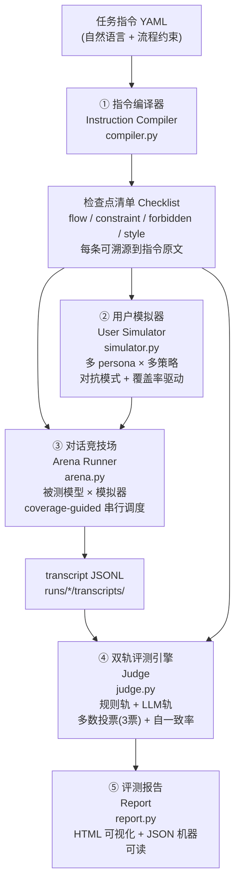

# EvalCall — 外呼对话模型指令遵循自动评测系统

> 美团黑客松·赛道二：复杂指令下的多轮对话评测系统
> 在线演示：https://kaijie0074-art.github.io/evalcall/

## 一句话定位

EvalCall 把「任务指令」编译成逐条可溯源的检查点，用对抗式用户模拟器批量跑对话轨迹，再通过双轨判定引擎自动出具可解释评测报告——把原本依赖人工抽听的外呼质检环节，变成可量化、可重复、可审计的自动化流程。

## 三层质量闭环（核心设计）

「做一个自动评测器」不是难点，难的是凭什么信它。EvalCall 的回答是三层闭环，全部在官方脱敏数据上实测落地：

| 层 | 回答的问题 | 机制 | 实测战绩 |
|----|-----------|------|---------|
| **评模型** | 模型守不守指令？ | 指令编译 → 对抗模拟 → 双轨判定（裁判提示词携带指令原文）→ 量化报告 | 官方两任务端到端实测，每条 fail 附对话原文证据 |
| **审指令** | 分低是模型差，还是指令本身有病？ | 指令体检器 `evalcall/lint.py`：自动检测自相矛盾/不可行/歧义/缺失分支，附修订建议 | 自主发现官方任务二「≤20字上限 vs 43字参考话术」物理冲突、任务一业务规则自相矛盾（详见 `runs/lint/`） |
| **校裁判** | 裁判自己判得准不准？ | 已知答案注入 `calibrate.py`：合成对话埋好真值 → 跑裁判 → 输出查准率/查全率/混淆矩阵 | 评测报告自带误差棒；开发中实测抓出并修复一例裁判系统性误判 |

配套：**测试充分性量化**——报告输出检查点触达率与测试盲区清单（从未被任何轨迹触达的检查点），「测得充分」从形容词变成百分比。

---

## 痛点

履约数字人每天产生海量外呼对话。任务指令往往包含复杂流程分支和多重合规约束（关键信息播报顺序、禁止话术、隐私保护要求等）。传统质检依赖人工抽听：

- **贵**：抽听成本随规模线性上升，全量覆盖几乎不可能
- **慢**：问题发现滞后，难以支撑快速迭代
- **难量化**：评分依赖个人经验，缺少统一标准，结果无法追溯

---

## 架构

### Mermaid



### ASCII（纯文本环境）

```
任务指令 YAML
     │
     ▼
① 指令编译器 compiler.py
   └─ 输出：检查点清单（flow/constraint/forbidden/style，每条含 source_quote）
     │
     ├──────────────────────┐
     ▼                      ▼
② 用户模拟器           ③ 对话竞技场 arena.py
   simulator.py            被测模型 × 模拟器
   多 persona × 多策略      coverage-guided 调度
   对抗 + 覆盖率驱动         └─ 输出：transcript JSONL
     │                      │
     └──────────────────────┘
                            ▼
                   ④ 双轨评测引擎 judge.py
                      规则轨（确定性）
                      LLM轨（逐检查点，证据引用，3票投票）
                      + 自一致率 / 双轨冲突率
                            │
                            ▼
                   ⑤ 评测报告 report.py
                      HTML 可视化报告
                      JSON 机器可读结果
```

---

## 五大组件说明

| 组件 | 文件 | 职责 |
|------|------|------|
| ① 指令编译器 | `evalcall/compiler.py` | 将自然语言任务指令解析为结构化检查点清单。每条检查点含 `id`、`type`（flow/constraint/forbidden/style）、`text`、`source_quote`（可溯源原文）、`severity`（critical/major/minor）。 |
| ② 用户模拟器 | `evalcall/simulator.py` | LLM 扮演被呼叫用户，支持六种 persona（配合型/打断型/跑题型/质疑型/情绪型/沉默型）。对抗模式：约束/禁止项作为对抗目标注入；coverage-guided：跨轨迹未触达的检查点被标记为优先攻击目标（cli 主循环反馈环，已实现非口号）。 |
| ③ 对话竞技场 | `evalcall/arena.py` | 编排被测模型与用户模拟器之间的多轮对话，coverage-guided 调度：每条轨迹判定后，未触达检查点作为优先攻击目标注入下一条轨迹（反馈环依赖前序判定，故按设计串行；无反馈模式可并行扩展）。输出标准 transcript JSONL。 |
| ④ 双轨评测引擎 | `evalcall/judge.py` | 规则轨（确定性检查：关键信息是否播报、禁语是否出现）+ LLM轨（逐检查点判定 pass/fail/NA，必须引用对话原文作为证据，3票多数投票定结论）。附带可靠性指标：judge 自一致率、规则/LLM 双轨冲突率。 |
| ⑤ 评测报告 | `evalcall/report.py` | 聚合判定结果，生成总分 + 四维雷达（流程完整度/约束遵循率/异常处理/话术合规）、逐检查点明细（结论+证据+置信度）、失败案例剖析、persona 维度切片。输出 HTML 可视化报告 + JSON 机器可读结果。 |

---

## 快速开始

### 安装依赖

```bash
pip install pyyaml jinja2 requests
# 可选：rich（终端彩色进度条）
pip install rich
```

### 配置 LLM 后端

EvalCall 支持三种后端，通过环境变量切换：

**方式一：本地 Claude CLI（开发/演示推荐，无需 API Key）**

```bash
export EVALCALL_BACKEND=claude-cli
# 确保本地已安装 claude CLI
```

**方式二：OpenAI 兼容 API**

```bash
export EVALCALL_BACKEND=openai
export OPENAI_BASE_URL=https://api.openai.com/v1
export OPENAI_API_KEY=sk-...
export EVALCALL_MODEL=gpt-4o
```

**方式三：Mock 回放（CI/无网演示兜底）**

```bash
export EVALCALL_BACKEND=mock
```

被测模型可独立配置（与评测用 LLM 后端分离）：

```bash
export TARGET_BACKEND=openai
export TARGET_BASE_URL=https://your-model-endpoint/v1
export TARGET_API_KEY=sk-...
export TARGET_MODEL=your-model-name
```

### 运行评测

```bash
# 跑一次完整评测（指定任务文件，默认 3 条轨迹）
python -m evalcall run --task data/tasks/delivery_confirm.yaml

# 指定 persona 和轨迹数
python -m evalcall run --task data/tasks/delivery_confirm.yaml --personas all --runs 5

# 生成/刷新报告（基于已有轨迹）
python -m evalcall report --run-dir runs/20260606_143000/
```

### 输出产物

```
runs/
└── 20260606_143000/          # 每次 run 按时间戳命名
    ├── transcripts/           # 原始对话轨迹（JSONL）
    │   ├── run_001.jsonl
    │   └── ...
    ├── judgments/             # 逐轨迹判定结果（JSON）
    │   ├── run_001_judgment.json
    │   └── ...
    ├── report.html            # HTML 可视化报告（浏览器直接打开）
    └── report.json            # 机器可读聚合结果
```

---

## 脱敏数据接入

### 路径一：在线模拟评测（无真实数据）

直接使用 `data/tasks/*.yaml` 中内置的模拟任务（已覆盖外卖催单确认、配送时间预约、商家回访、超时安抚、隐私合规五类场景）。无需任何真实数据即可完整跑通评测流程。

```bash
python -m evalcall run --task data/tasks/delivery_confirm.yaml
```

### 路径二：离线轨迹评测（接入真实/脱敏数据）

若已有脱敏对话轨迹，可跳过模拟器直接送入评测引擎：

1. 将脱敏轨迹转换为标准 JSONL 格式（字段映射说明见 `data/README.md`）
2. 把轨迹文件放入 `runs/<your-dir>/transcripts/`
3. 执行报告生成命令

```bash
python -m evalcall report --run-dir runs/your-data-dir/
```

官方数据到达后，只需按 `data/README.md` 的字段映射表做一次格式转换，无需修改评测逻辑。

---

## 创新点

1. **指令→检查点编译，可溯源**：评的不是笼统印象，而是逐条对应指令原文的检查点。评测结论有原文依据，可审计、可复现。

2. **对抗式模拟器 + coverage-guided 反馈环**：模拟器不随机聊天——约束项作为对抗目标定向诱导，且每条轨迹判定后未触达检查点自动成为下一条轨迹的优先攻击目标（对标 FLARE 的 coverage-guided behavioral fuzzing，首次用于对话指令遵循质检）。报告输出触达率与盲区清单。

3. **双轨判定 + 多数投票 + 自一致率**：规则轨保证确定性，LLM 轨处理语义复杂场景，3票多数投票降低单次误判风险，自一致率和双轨冲突率提供评测结果的可靠性度量。

4. **数据即插即用**：格式适配层将脱敏数据映射到内部 schema，评测逻辑与数据格式解耦。官方数据一到，换个目录就能跑，无需修改核心代码。

---

## 目录结构

```
美团黑客松/
├── SPEC.md                          # 赛题规格与架构设计
├── evalcall/
│   ├── __init__.py
│   ├── llm.py                       # LLM 后端抽象（openai/claude-cli/mock）
│   ├── compiler.py                  # ① 指令编译器
│   ├── simulator.py                 # ② 用户模拟器
│   ├── arena.py                     # ③ 对话竞技场
│   ├── judge.py                     # ④ 双轨评测引擎
│   ├── report.py                    # ⑤ 报告数据聚合
│   ├── templates/report.html.j2     # HTML 报告模板
│   └── cli.py                       # 命令行入口
├── data/
│   ├── tasks/*.yaml                 # 模拟任务指令库
│   ├── personas/*.yaml              # 用户 persona 库
│   └── README.md                    # 脱敏数据接入说明
├── runs/                            # 输出：轨迹 + 判定 + 报告
├── README.md                        # 本文件
└── docs/                            # 提交材料
```

---

## 版本

`0.1.0` — 黑客松演示版
